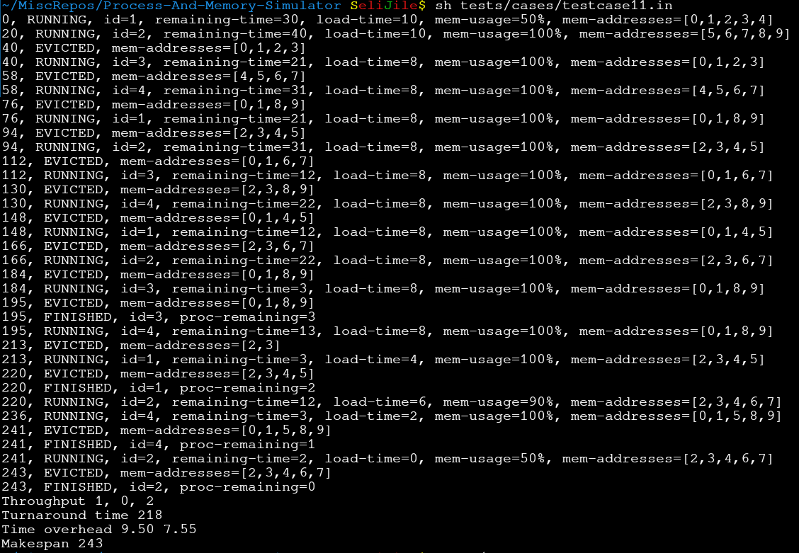

## Process Scheduling and Memory Management Simulator

Program investigates performance of a variety of scheduling and memory management algorithms used within an Operating System's kernel. The simulation
outputs information about its state whenever a process starts, finishes, or pages are evicted from memory, along with performance statistics once 
all processes have been finished.

For a much more
detailed outline of the project, see ` project2.pdf`. See `report.txt` for a short explanation of the custom scheduling and memory management
algorithms and the situations where they perform better.

#### Project Structure
* `scheduler.c` and its accompanying header file contain all scheduling algorithms, memory management algorithms and option parsing
for the various flags that may be passed.
* `process-deque.c`and its accompanying header file contain the doubly linked list data structure and accompanying helper functions used by scheduler.
This linked list serves as a queue for incoming processes in the simulation, and allows for sorting of elements to accomodate use as a priority queue.
* `memory.c` and its accompanying header file contain the Memory struct and all helper functions pertaining to simulating memory management. These
functions are used throughout the scheduling and memory management algorithms contained in `scheduler.c`
* `statistics.c` and its accompanying header file contain the Statistics struct and all functions concerned with updating and calculating the final
statistics outputted by the program when all processes have finished.
* `benchmark-*.txt` files contain process data where the custom scheduling (shortest first) and custom memory management (fair
allocation) algorithms out-perform the algorithms given in the spec
* `tests/cases/` contain test input, and the correct output, for various combinations of scheduling and memory management algorithms
* All other .txt files (apart from `report.txt`) contain process data for tests given in `tests/cases/`.

#### Output

* Each line of output (apart from the final performance statistics) begins with a timestamp of the event
* Whenever the scheduler switches processes, it outputs a line with the `RUNNING` field, along with:
  - Process id
  - Remaining time until the process is complete
  - Load time, simulating the time taken to load the required pages into memory
  - Current memory usage, and the memory addresses of the pages used by the process
* Whenever the scheduler finishes executing a process, it outputs a line with the `FINISHED` field, along with:
  - The process id of that which was finished
  - The number of remaining process
* Whenever memory is full (or if virtual memory is enabled, a processes memory requirement - 4 isn't available), a line is outputted with the `EVICTED`
field, along with the addresses of the pages that were evicted
* When all processes have been completed performance is summarised with:
  - Throughput denotes the average (rounded up), minimum and maximum number of processes completed in sequential, non-overlapping 60 second intervals
  - Turnaround time is the average time (in seconds, rounded up to an integer) between the time a process arrives and is subsequently completed.
  - Time overhead denotes the maximum and average time overhead, where overhead is defined as the turnaround time of the process divided by its job time
  - Makespan is the time in seconds where the simulation ended

#### Scheduling Algorithms Implemented:
* First come first served
* Round robin
* Custom Scheduler: Shortest first

#### Memory Management Algorithms Implemented:
* Swapping X
* Virtual Memory
* Custom Memory Management: Fair Memory Allocation

